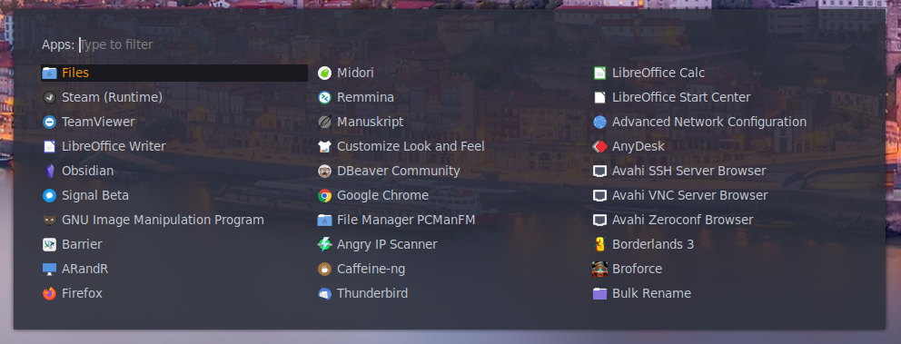
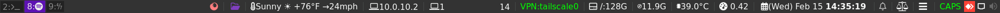
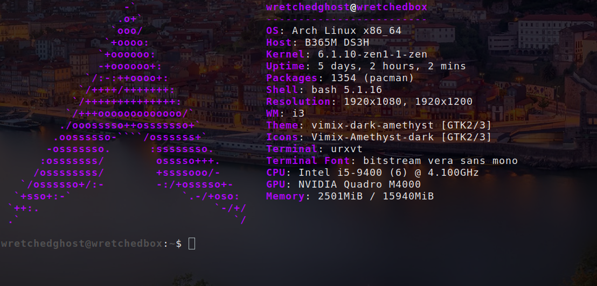
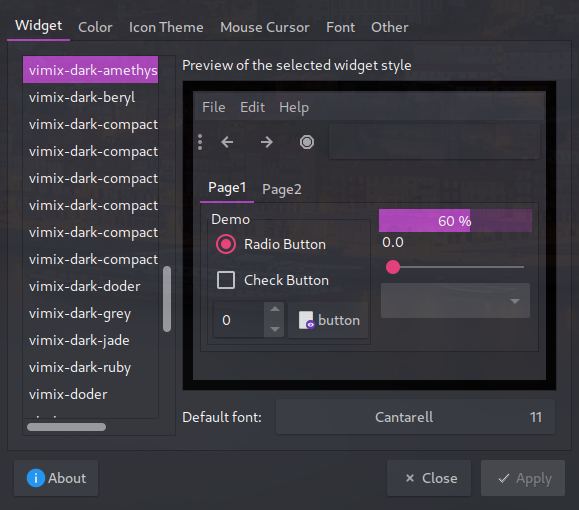
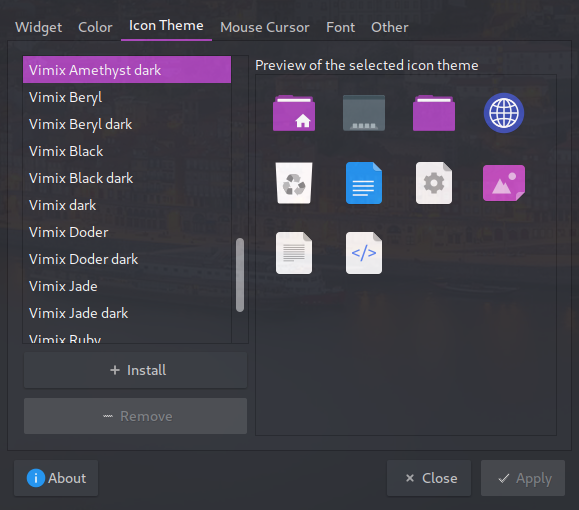

# My i3 Setup
What we have here is my latest i3 config for my workstation. My theme is based on three colors: purple, white, and grey, with hints of orange. 

## Home Screen
Here are some pictures of my screen using scrot. The wallpapers are of one my favorite places in the world: Porto, Portugal. They rotate every login using my .fehbg script that is run everytime your login. You can force a backgroud change by running `./fehbg`.

***Don't mind the gap on the left screen.*** That is due to my left screen being a 1920x1080 (16:9) while my right screen is a 1920x1200 (16:10), but it only looks like this in the screenshot not on the hardware itself. 


## Rofi
Here is what my custom config looks like which includes transparency and highlights the last run program for easy access.



## i3Blocks
I obsfucated my public IP, even though its my tailscale public IP, for obvious reasons.



My bar shows icons, workspace number, the weather, when VPNs are connected, private IP address, space left in `/`, RAM, CPU usage and temp, a date that you can click on which opens a dropdown menu calendar, the ability to control the CPU speeds (this is meant for laptops), etc.

You will need to change the weather to your city_State in the `~/.config/i3/i3blocks/i3blocks` file under [rofi-wttr]->Location.

## urxvt Terminal


I have customized `neofetch` to show the arch logo and the titles in a custom purple color. It took me a good while to find the color I was looking for. You can find it at the bottom of my .bashrc file. You also need to copy the .Xresources file to your home directory to get urxvt to look like mine. It also carries a few sane features needed in a terminal. 

## Theme



## Color Chooser
The site I used to find the colors I was looking for.

[https://htmlcolorcodes.com/colors/](https://htmlcolorcodes.com/colors/)

## Prerequisites and some recomendations
* Arch (This config might work with other distros but I haven't tested it anything other than Arch)
* i3-wm (Desktop Environment)
* i3blocks (Top Menu Bar)
  * NetworkManager (Needed for nm-vpn Blocket)
  * networkmanager-openvpn
  * perl-json (Needed for weather_NOAA Blocklet)
  * tailscale
* vim (My personal favorite text editor)
* feh (A simple but effective photo viewer and wallpaper setter)
* urxvt-perls (Also my personal favorite terminal emulator once its been configured. Otherwise urxvt is ugly as crap)
* firefox (I swapped from Brave to Firefox due to Chrome and Chrome-clones security/privacy concerns. And especially with Chrome's eventual move to web 3.0)
* rofi (Program/app menu. Replaces dmenu as it is better looking and more configurable) 
* dunst (Notification pop-up program) 
* scrot (For taking screenshots)
* neofetch (Shows hardware and flashy info in the terminal)
* ttf-font-awesome (For all the cool image logos)
* ttf-dejavu (My standard font for everything else)
* ttf-monoid (A great font for the terminal)
* gsimplecal (Simple GUI calendar)
* galculator (Gnome calculator)
* conky (It is designed to show clock and date on main screen in my config)
* picom (Window transperancy and window shadow. A must need for your windows to look extra cool)
* redshift (Sets color screen and can be set on a schedule. Usually only for laptops but can work well on a desktop if you are a night-owl like myself and don't like your eyes to burn with bright white windows)
* thunar or pcmanfm (Both are good file managers. pcmanfm is lighter weight but thunar has some pretty cool options, bulk-rename, etc.)
* voluemicon (Tray volume icon)
* networkmanager-applet (Tray networkmanager icon)

##### AUR
* vimix-icon-theme 
* vimix-gtk-themes 
* vimix-cursors

### For laptops
* To allow for laptop lid to enable `i3lock`, create this file and add the below config to `/etc/systemd/system/suspend@.service`:

```text
[Unit]
Description=User suspend actions
Before=sleep.target

[Service]
User=%I
Type=forking
Environment=DISPLAY=:0
ExecStartPre= /usr/bin/sleep 1
ExecStart= /home/wretchedghost/.config/i3/scripts/lock_and_blur.sh

[Install]
WantedBy=sleep.target
```

Change `ExecStart=` to the location where your i3lock.sh or lock_and_blur.sh is located. 

Then enable by running `sudo systemctl enable suspend@user.service` (with your username instead of `user`).

## Steps to make your setup look like mine
1. Install all of the prerequisite program above.
2. Run `git clone https://github.com/wretchedghost/i3-wretchedbox`.
3. `cd i3-wretchedbox`
4. `cp -R Pictures/Portugal ~/Pictures/`
5. Install `lightdm-slick-greeter` via package manager. Enable lightdm via systemd by running `sudo systemctl enable lightdm`
6. `sudo cp background.jpg /usr/share/pixmaps/`.
7. `sudo rm -rf /etc/lightdm/`
8. `sudo cp -R lightdm /etc/lightdm`. 
9. Run `source ~/.bashrc`.

Reboot for the system to start lightdm. You might have to chmod +x to /etc/lightdm/Xsession for it to work right. 

## What my Lightdm background looks like


## Libreoffice uses a different way to work with a theme so follow below to make it look better

1. cd i3-wretchedbox
2. cp libreoffice-writer.desktop ~/.local/share/applications/

## Add touch to click, lrm, and other to touchpad

```bash
/etc/X11/xorg.conf.d/90-touchpad.conf
Section "InputClass"
        Identifier "touchpad"
        MatchIsTouchpad "on"
        Driver "libinput"
        Option "Tapping" "on"
        Option "NaturalScrolling" "true"
        Option "TappingButtonMap" "lrm" # 1/2/3 finger, for 3-finger middle lrm
EndSection
```

## My bashrc config

### A few unique things that I run on my .bashrc are:
* My history size is 20000 and I ignore certain multiple words in my history.
* I have several **shopt** options found in bash that make things better like globbing and cdspell which fixes spelling when I spell a dir wrong, just to name a few.
* alias for using .. and ... which will do the same a **cd ..** and **cd ../..** and further.
* alias for my fat-fingering when typing exit.
* alias for gitc and gitp found at lines 171 and 172 which make commiting and push way easier.
* mvg for move and go when changing dirs.
* Neofetch with custom colors painstakingly found after trying each combo one-by-one.
